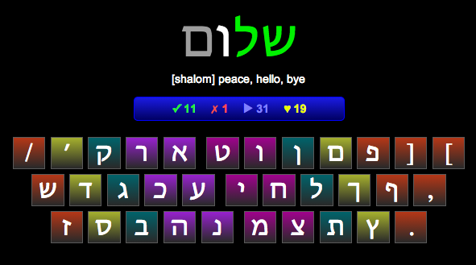

# vogame

Just a simple application for learning vocabulary while improving your typing skills at the same time. It is especially aimed at languages using another keyboard layout.

## Installation

After clonning this repository just run the following:

    npm install && npm start

The application should now be available at [http://localhost:8080](http://localhost:8080).

## Features

Pretty much what you see on the screenshot is there.

## License

MIT
